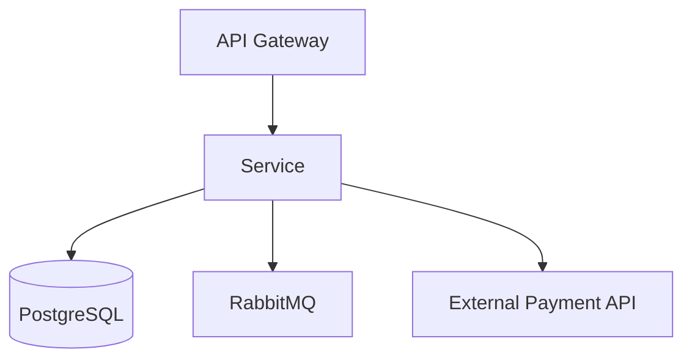
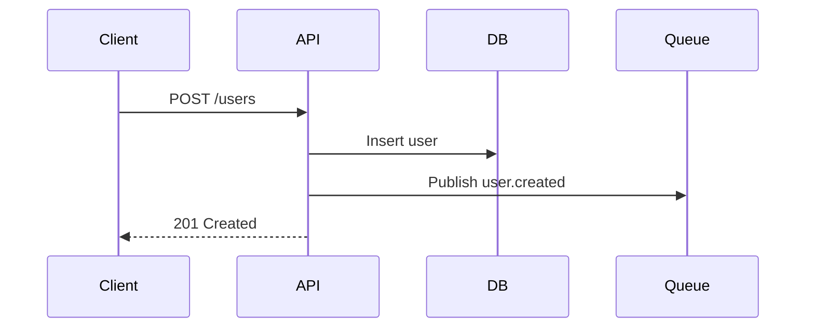

# Document a Software Service

Generate high-level documentation for a software service. The output should be useful for stakeholders and new team members.

## Workflow

### 1. Understand the service

Before writing anything, explore the codebase to understand:
- What the service does (README, main entrypoint, config)
- Tech stack (languages, frameworks, databases, queues, external dependencies)
- Key domain concepts

Use Glob and Grep to find entrypoints, route definitions, database schemas, message handlers, and configuration files.

### 2. Write the documentation

Structure the document with these sections:

#### Overview
A short paragraph (3-5 sentences) explaining what the service is, why it exists, and who uses it. Avoid implementation details - focus on the business purpose.

#### Core Responsibilities
A bulleted list of what this service owns. Be specific but stay at the domain level, not the code level.

#### Architecture

Describe the main components and how they connect. Use a Mermaid diagram to visualize:
- Web server / API layer
- Databases
- Message queues / event buses
- External services / dependencies
- Caches, schedulers, background workers

Example:
~~~markdown

~~~

Only include components that exist. Keep it high-level - no internal class hierarchies.

#### Key Use Cases

For each base use case (e.g. register-user, process-payment):
- **Entrypoint**: where the flow starts (HTTP endpoint, message consumer, cron job)
- **Sequence diagram**: a simple Mermaid sequence diagram showing the main actors and steps

Example:
~~~markdown

~~~

Keep sequences to 5-10 steps max. If it's more complex, you're going too deep.

#### ADRs

Check if an `adr/`, `adrs/`, `docs/adr/`, or `docs/decisions/` folder exists. If it does, add a section pointing to it:

```markdown
## Architecture Decision Records
Design decisions for this service are documented in [`docs/adr/`](docs/adr/).
```

If no ADR folder exists, skip this section.

### 3. Review with the user

Present the draft. Ask for feedback. Iterate until approved.

## Guidelines

- **Stay high-level.** No function signatures, class names, or implementation details. If a new team member wouldn't care about it in their first week, leave it out.
- **Prefer diagrams over prose** for architecture and flows.
- **Use Mermaid** for all diagrams so they render in GitHub/GitLab and are easy to update.
- **Keep it maintainable.** Diagrams that are too detailed become stale fast. Fewer boxes, more value.
- **Point to code, don't duplicate it.** Reference file paths or folders instead of copying code snippets.
